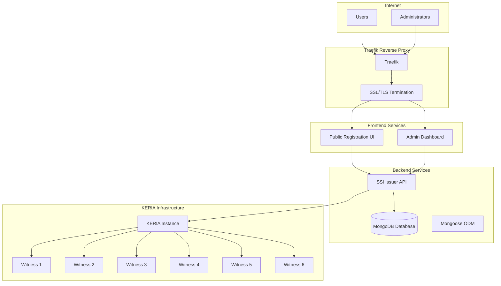
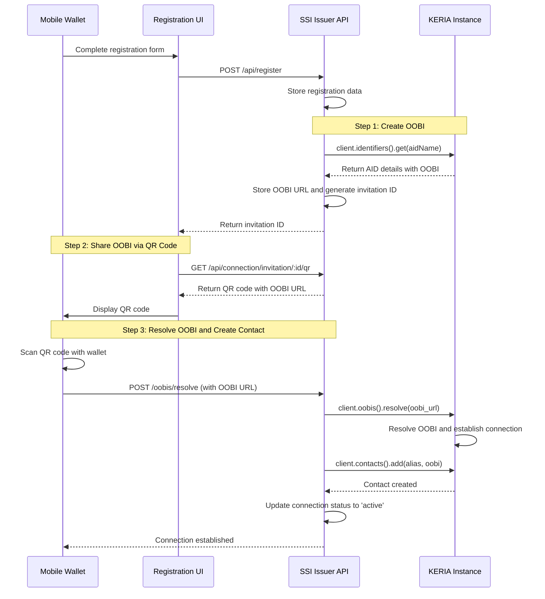
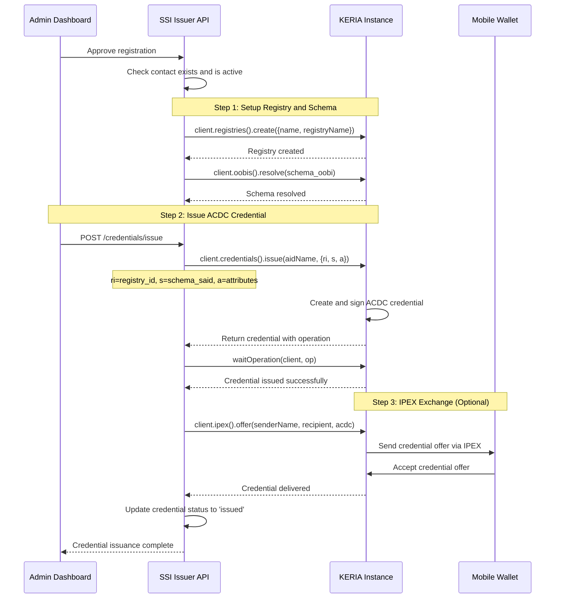

# Design Document

## Overview

The SSI Issuing Platform is a comprehensive standalone self-sovereign identity credential issuance system built on KERIA and signify-ts. The platform consists of three main components: a backend API service, an admin dashboard, and a public registration interface, all deployed with Traefik as a reverse proxy. The system operates independently with its own KERIA instance and witness network, enabling administrators to manage credential schemas, review user applications, and issue verifiable credentials while providing a secure and user-friendly experience for credential recipients.

## Architecture

### High-Level Architecture



### Component Architecture

The platform follows a modular architecture with clear separation of concerns:

1. **Reverse Proxy Layer**: Traefik for routing, SSL termination, and load balancing
2. **Frontend Layer**: React-based admin dashboard and public registration interface
3. **API Layer**: Express.js backend with signify-ts integration
4. **Data Layer**: MongoDB database with Mongoose ODM for persistent storage
5. **Cryptographic Layer**: Dedicated KERIA instance and witness network for SSI operations

## Agent-to-Agent Connection Workflow

### Connection Establishment Process

The platform implements KERIA's OOBI (Out-Of-Band Introduction) pattern using signify-ts:



### Credential Issuance Process

Following the signify-ts ACDC credential issuance pattern:



### Connection States (KERIA/signify-ts pattern)

Following the KERIA OOBI and contact management pattern:

1. **oobi_created**: OOBI URL generated and available for sharing
2. **oobi_shared**: QR code displayed to user
3. **oobi_resolved**: OOBI resolved by recipient
4. **contact_added**: Contact established in KERIA
5. **active**: Connection ready for credential exchange
6. **error**: Connection failed at any stage

### Credential States (ACDC pattern)

Following the ACDC credential lifecycle:

1. **registry_created**: Credential registry established
2. **schema_resolved**: Schema OOBI resolved and available
3. **credential_issued**: ACDC credential created and signed
4. **credential_stored**: Credential stored in issuer's KERIA
5. **ipex_offered**: Credential offered via IPEX (optional)
6. **ipex_accepted**: Credential accepted by holder (optional)
7. **credential_revoked**: Credential revoked by issuer

### IPEX Exchange States (Optional)

For credential exchange via IPEX protocol:

1. **apply_sent**: Credential application sent
2. **offer_sent**: Credential offer sent
3. **agree_sent**: Agreement to credential sent
4. **grant_sent**: Credential granted and delivered

## Components and Interfaces

### 1. Backend API Service (`ssi-issuer-api`)

**Technology Stack:**
- Node.js with TypeScript
- Express.js framework
- signify-ts for KERIA integration
- MongoDB with Mongoose ODM
- CORS and security middleware

**Key Modules:**
- **Authentication Module**: Admin authentication and session management
- **SignifyClient Integration**: KERIA client management and connection pooling
- **Schema Management Module**: Schema CRUD with OOBI resolution
- **Registry Management Module**: KERIA registry creation and management
- **Connection Management Module**: Contact establishment and OOBI sharing
- **Credential Issuance Module**: ACDC credential creation using signify-ts
- **IPEX Module**: Credential exchange protocol implementation
- **Transaction Logging Module**: Audit trail management

**API Endpoints:**
```
Public Endpoints:
POST /api/register - User registration
GET /api/schemas/public - Available schemas for registration

Connection Management (signify-ts pattern):
POST /contacts - Create contact and resolve OOBI
GET /contacts - List all contacts
GET /contacts/:alias - Get contact details
POST /oobis/resolve - Resolve OOBI for connection
GET /api/connection/invitation/:id/qr - Get QR code for OOBI

Credential Exchange (signify-ts pattern):
POST /credentials/issue - Issue ACDC credential
GET /credentials - List stored credentials
POST /registries - Create credential registry
GET /registries - List registries
GET /schemas - List resolved schemas
POST /oobis/resolve - Resolve schema OOBIs
POST /ipex/apply - Apply for credential via IPEX
POST /ipex/offer - Offer credential via IPEX

Admin Endpoints:
POST /api/admin/login - Admin authentication
GET /api/admin/registrations - Pending user registrations
PUT /api/admin/registrations/:id/approve - Approve registration
PUT /api/admin/registrations/:id/reject - Reject registration
POST /api/admin/credentials/issue - Issue credential
GET /api/admin/credentials - List all credentials
PUT /api/admin/credentials/:id/revoke - Revoke credential
GET /api/admin/connections - List connections
GET /api/admin/transactions - List transactions
POST /api/admin/schemas - Create schema
GET /api/admin/schemas - List schemas
PUT /api/admin/schemas/:id/default - Set default schema
```

### 2. Admin Dashboard (`ssi-issuer-admin`)

**Technology Stack:**
- React 19 with TypeScript
- Material-UI (MUI) for components
- Redux Toolkit for state management
- React Router for navigation
- Axios for API communication

**Key Features:**
- **Dashboard Overview**: Statistics and recent activity
- **Schema Management**: Create, edit, and set default schemas
- **Registration Review**: Review and approve/reject user applications
- **Credential Management**: View, search, and revoke issued credentials
- **Connection Monitor**: View and manage KERIA connections
- **Transaction Log**: Audit trail of all system activities

### 3. Public Registration Interface (`ssi-issuer-public`)

**Technology Stack:**
- React 19 with TypeScript
- Material-UI for consistent styling
- Form validation with react-hook-form
- QR code generation for mobile integration

**Key Features:**
- **Registration Form**: User information collection
- **Schema Selection**: Choose credential type to request
- **Status Tracking**: Check application status
- **Mobile Integration**: QR codes for wallet connection

### 4. Database Schema

**MongoDB Collections with Mongoose Schemas:**

```typescript
// User registrations collection
const registrationSchema = new Schema({
  email: { 
    type: String, 
    required: true, 
    unique: true, 
    lowercase: true,
    trim: true,
    validate: {
      validator: function(email: string) {
        return /^[^\s@]+@[^\s@]+\.[^\s@]+$/.test(email);
      },
      message: 'Invalid email format'
    }
  },
  fullName: { type: String, required: true, trim: true, maxlength: 100 },
  phone: { type: String, trim: true, maxlength: 20 },
  organization: { type: String, trim: true, maxlength: 100 },
  requestedSchemaId: { type: String, required: true, ref: 'CredentialSchema' },
  status: { 
    type: String, 
    enum: ['pending', 'approved', 'rejected'], 
    default: 'pending',
    index: true
  },
  applicationData: { type: Schema.Types.Mixed, required: true },
  connectionId: { type: String, sparse: true, index: true },
  connectionStatus: { 
    type: String, 
    enum: ['pending', 'connected', 'failed'], 
    default: 'pending',
    index: true
  },
  reviewedBy: { type: String, ref: 'AdminUser' },
  reviewedAt: { type: Date },
  notes: { type: String, trim: true, maxlength: 500 }
}, { 
  timestamps: true,
  indexes: [
    { email: 1 },
    { status: 1, createdAt: -1 },
    { connectionStatus: 1 },
    { requestedSchemaId: 1 }
  ]
});

// Credential schemas collection
const credentialSchemaSchema = new Schema({
  _id: { type: String, required: true }, // Custom string ID
  name: { type: String, required: true, trim: true, maxlength: 100, unique: true },
  description: { type: String, trim: true, maxlength: 500 },
  version: { type: String, default: '1.0.0', trim: true },
  schemaData: { 
    type: Schema.Types.Mixed, 
    required: true,
    validate: {
      validator: function(data: any) {
        return data && 
               typeof data === 'object' && 
               data.type && 
               data.properties &&
               typeof data.properties === 'object';
      },
      message: 'Schema data must be a valid JSON Schema with type and properties'
    }
  },
  isDefault: { type: Boolean, default: false, index: true },
  isActive: { type: Boolean, default: true, index: true },
  createdBy: { type: String, ref: 'AdminUser' }
}, { 
  timestamps: true,
  indexes: [
    { name: 1 },
    { isDefault: 1 },
    { isActive: 1 },
    { createdAt: -1 }
  ]
});

// Issued credentials collection
const issuedCredentialSchema = new Schema({
  _id: { type: String, required: true }, // Custom string ID (KERIA credential ID)
  registrationId: { type: Schema.Types.ObjectId, required: true, ref: 'Registration', index: true },
  schemaId: { type: String, required: true, ref: 'CredentialSchema', index: true },
  recipientIdentifier: { type: String, required: true, index: true },
  recipientEmail: { type: String, required: true, lowercase: true, index: true },
  credentialData: { type: Schema.Types.Mixed, required: true },
  keriaCredentialId: { type: String, required: true, unique: true },
  registryId: { type: String, required: true },
  status: { 
    type: String, 
    enum: ['issued', 'active', 'revoked', 'expired'], 
    default: 'issued',
    index: true
  },
  issuedAt: { type: Date, default: Date.now, index: true },
  expiresAt: { type: Date, index: true },
  revokedAt: { type: Date },
  revokedBy: { type: String, ref: 'AdminUser' },
  revokedReason: { type: String, trim: true, maxlength: 200 },
  issuedBy: { type: String, required: true, ref: 'AdminUser' }
}, { 
  timestamps: true,
  indexes: [
    { registrationId: 1 },
    { schemaId: 1 },
    { recipientIdentifier: 1 },
    { status: 1, issuedAt: -1 },
    { keriaCredentialId: 1 },
    { expiresAt: 1 } // For TTL cleanup of expired credentials
  ]
});

// Connection invitations collection
const connectionInvitationSchema = new Schema({
  invitationId: { type: String, required: true, unique: true },
  registrationId: { type: Schema.Types.ObjectId, required: true, ref: 'Registration', index: true },
  oobiUrl: { type: String, required: true },
  invitationData: { type: Schema.Types.Mixed, required: true },
  state: { 
    type: String, 
    enum: ['created', 'shared', 'resolved', 'connected', 'failed', 'expired'], 
    default: 'created',
    index: true
  },
  keriaContactAlias: { type: String, trim: true },
  errorMessage: { type: String, trim: true },
  expiresAt: { 
    type: Date, 
    required: true,
    index: { expireAfterSeconds: 0 } // MongoDB TTL index for automatic cleanup
  }
}, { 
  timestamps: true,
  indexes: [
    { invitationId: 1 },
    { registrationId: 1 },
    { state: 1 },
    { expiresAt: 1 }
  ]
});

// Active connections collection (KERIA contacts)
const connectionSchema = new Schema({
  contactAlias: { type: String, required: true, unique: true, trim: true },
  registrationId: { type: Schema.Types.ObjectId, ref: 'Registration', index: true },
  invitationId: { type: String, ref: 'ConnectionInvitation' },
  contactData: { type: Schema.Types.Mixed, required: true }, // KERIA contact details
  theirIdentifier: { type: String, trim: true, index: true },
  ourIdentifier: { type: String, trim: true },
  state: { 
    type: String, 
    enum: ['pending', 'active', 'inactive', 'error'], 
    default: 'pending',
    index: true
  },
  lastActivity: { type: Date, default: Date.now, index: true },
  metadata: { type: Schema.Types.Mixed, default: {} }
}, { 
  timestamps: true,
  indexes: [
    { contactAlias: 1 },
    { registrationId: 1 },
    { theirIdentifier: 1 },
    { state: 1 },
    { lastActivity: -1 }
  ]
});

// Transaction log collection
const transactionSchema = new Schema({
  type: { 
    type: String, 
    enum: [
      'registration_created', 'registration_approved', 'registration_rejected',
      'credential_issued', 'credential_revoked', 
      'connection_created', 'connection_established', 'connection_failed',
      'schema_created', 'schema_updated', 'schema_activated', 'schema_deactivated',
      'admin_login', 'admin_logout', 'system_error'
    ], 
    required: true,
    index: true
  },
  entityType: {
    type: String,
    enum: ['registration', 'credential', 'connection', 'schema', 'admin', 'system'],
    required: true,
    index: true
  },
  entityId: { type: String, required: true, trim: true, index: true },
  details: { type: Schema.Types.Mixed, required: true },
  performedBy: { type: String, ref: 'AdminUser' },
  ipAddress: { type: String, trim: true },
  userAgent: { type: String, trim: true },
  timestamp: { type: Date, default: Date.now, index: true },
  severity: {
    type: String,
    enum: ['info', 'warning', 'error', 'critical'],
    default: 'info',
    index: true
  }
}, { 
  timestamps: false, // Using custom timestamp field
  indexes: [
    { type: 1, timestamp: -1 },
    { entityType: 1, entityId: 1 },
    { performedBy: 1, timestamp: -1 },
    { severity: 1, timestamp: -1 },
    { timestamp: -1 } // For cleanup and general queries
  ]
});

// Admin users collection
const adminUserSchema = new Schema({
  username: { 
    type: String, 
    required: true, 
    unique: true, 
    trim: true,
    minlength: 3,
    maxlength: 30,
    validate: {
      validator: function(username: string) {
        return /^[a-zA-Z0-9_-]+$/.test(username);
      },
      message: 'Username can only contain letters, numbers, underscores, and hyphens'
    }
  },
  passwordHash: { type: String, required: true },
  email: { 
    type: String, 
    required: true, 
    unique: true, 
    lowercase: true, 
    trim: true,
    validate: {
      validator: function(email: string) {
        return /^[^\s@]+@[^\s@]+\.[^\s@]+$/.test(email);
      },
      message: 'Invalid email format'
    }
  },
  fullName: { type: String, required: true, trim: true, maxlength: 100 },
  role: {
    type: String,
    enum: ['admin', 'operator', 'viewer'],
    default: 'operator',
    index: true
  },
  isActive: { type: Boolean, default: true, index: true },
  lastLogin: { type: Date, index: true },
  loginAttempts: { type: Number, default: 0 },
  lockUntil: { type: Date },
  passwordChangedAt: { type: Date, default: Date.now }
}, { 
  timestamps: true,
  indexes: [
    { username: 1 },
    { email: 1 },
    { isActive: 1 },
    { role: 1 },
    { lastLogin: -1 }
  ]
});

// KERIA registries collection (for tracking credential registries)
const keriaRegistrySchema = new Schema({
  registryId: { type: String, required: true, unique: true },
  name: { type: String, required: true, trim: true },
  schemaId: { type: String, required: true, ref: 'CredentialSchema', index: true },
  keriaIdentifier: { type: String, required: true },
  registryData: { type: Schema.Types.Mixed, required: true },
  isActive: { type: Boolean, default: true, index: true },
  createdBy: { type: String, required: true, ref: 'AdminUser' }
}, {
  timestamps: true,
  indexes: [
    { registryId: 1 },
    { schemaId: 1 },
    { isActive: 1 },
    { createdAt: -1 }
  ]
});
```

## Data Models

### Registration Model (Mongoose Document)
```typescript
interface IRegistration extends Document {
  email: string;
  fullName: string;
  phone?: string;
  organization?: string;
  requestedSchemaId: string;
  status: 'pending' | 'approved' | 'rejected';
  applicationData: Record<string, any>;
  connectionId?: string;
  connectionStatus: 'pending' | 'connected' | 'failed';
  reviewedBy?: string;
  reviewedAt?: Date;
  notes?: string;
  createdAt: Date;
  updatedAt: Date;
  
  // Instance methods
  approve(reviewedBy: string, notes?: string): Promise<IRegistration>;
  reject(reviewedBy: string, notes?: string): Promise<IRegistration>;
  updateConnectionStatus(connectionId: string, status: string): Promise<IRegistration>;
  
  // Static methods
  static findPending(): Promise<IRegistration[]>;
  static findByEmail(email: string): Promise<IRegistration | null>;
  static findByConnectionId(connectionId: string): Promise<IRegistration | null>;
}
```

### Schema Model (Mongoose Document)
```typescript
interface ICredentialSchema extends Document {
  id: string; // Custom string ID
  name: string;
  description?: string;
  version: string;
  schemaData: {
    type: string;
    properties: Record<string, any>;
    required: string[];
  };
  isDefault: boolean;
  isActive: boolean;
  createdBy: string;
  createdAt: Date;
  updatedAt: Date;
  
  // Instance methods
  makeDefault(): Promise<ICredentialSchema>;
  activate(): Promise<ICredentialSchema>;
  deactivate(): Promise<ICredentialSchema>;
  validateSchemaData(): boolean;
  
  // Static methods
  static getDefault(): Promise<ICredentialSchema | null>;
  static findActive(): Promise<ICredentialSchema[]>;
  static findByName(name: string): Promise<ICredentialSchema | null>;
}
```

### Credential Model (Mongoose Document)
```typescript
interface IIssuedCredential extends Document {
  id: string; // Custom string ID (KERIA credential ID)
  registrationId: string;
  schemaId: string;
  recipientIdentifier: string;
  recipientEmail: string;
  credentialData: Record<string, any>;
  keriaCredentialId: string;
  registryId: string;
  status: 'issued' | 'active' | 'revoked' | 'expired';
  issuedAt: Date;
  expiresAt?: Date;
  revokedAt?: Date;
  revokedBy?: string;
  revokedReason?: string;
  issuedBy: string;
  createdAt: Date;
  updatedAt: Date;
  
  // Instance methods
  revoke(revokedBy: string, reason?: string): Promise<IIssuedCredential>;
  isExpired(): boolean;
  canBeRevoked(): boolean;
  
  // Static methods
  static findByRecipient(recipientIdentifier: string): Promise<IIssuedCredential[]>;
  static findBySchema(schemaId: string): Promise<IIssuedCredential[]>;
  static findActive(): Promise<IIssuedCredential[]>;
  static findExpired(): Promise<IIssuedCredential[]>;
}
```

### Connection Model (Mongoose Document)
```typescript
interface IConnection extends Document {
  contactAlias: string;
  registrationId?: string;
  invitationId?: string;
  contactData: Record<string, any>;
  theirIdentifier?: string;
  ourIdentifier?: string;
  state: 'pending' | 'active' | 'inactive' | 'error';
  lastActivity: Date;
  metadata: Record<string, any>;
  createdAt: Date;
  updatedAt: Date;
  
  // Instance methods
  updateState(newState: string): Promise<IConnection>;
  updateActivity(): Promise<IConnection>;
  
  // Static methods
  static findByAlias(alias: string): Promise<IConnection | null>;
  static findByRegistration(registrationId: string): Promise<IConnection | null>;
  static findActive(): Promise<IConnection[]>;
}
```

### Transaction Model (Mongoose Document)
```typescript
interface ITransaction extends Document {
  type: string;
  entityType: 'registration' | 'credential' | 'connection' | 'schema' | 'admin' | 'system';
  entityId: string;
  details: Record<string, any>;
  performedBy?: string;
  ipAddress?: string;
  userAgent?: string;
  timestamp: Date;
  severity: 'info' | 'warning' | 'error' | 'critical';
  
  // Static methods
  static log(
    type: string, 
    entityType: string, 
    entityId: string, 
    details: Record<string, any>,
    performedBy?: string,
    severity?: string
  ): Promise<ITransaction>;
  static findByEntity(entityType: string, entityId: string): Promise<ITransaction[]>;
  static findByUser(userId: string): Promise<ITransaction[]>;
  static cleanup(olderThanDays: number): Promise<number>;
}
```

### Admin User Model (Mongoose Document)
```typescript
interface IAdminUser extends Document {
  username: string;
  passwordHash: string;
  email: string;
  fullName: string;
  role: 'admin' | 'operator' | 'viewer';
  isActive: boolean;
  lastLogin?: Date;
  loginAttempts: number;
  lockUntil?: Date;
  passwordChangedAt: Date;
  createdAt: Date;
  updatedAt: Date;
  
  // Instance methods
  comparePassword(password: string): Promise<boolean>;
  updateLastLogin(): Promise<IAdminUser>;
  incrementLoginAttempts(): Promise<IAdminUser>;
  resetLoginAttempts(): Promise<IAdminUser>;
  isLocked(): boolean;
  
  // Static methods
  static findByUsername(username: string): Promise<IAdminUser | null>;
  static findByEmail(email: string): Promise<IAdminUser | null>;
  static findActive(): Promise<IAdminUser[]>;
}
```

### KERIA Registry Model (Mongoose Document)
```typescript
interface IKeriaRegistry extends Document {
  registryId: string;
  name: string;
  schemaId: string;
  keriaIdentifier: string;
  registryData: Record<string, any>;
  isActive: boolean;
  createdBy: string;
  createdAt: Date;
  updatedAt: Date;
  
  // Instance methods
  activate(): Promise<IKeriaRegistry>;
  deactivate(): Promise<IKeriaRegistry>;
  
  // Static methods
  static findBySchema(schemaId: string): Promise<IKeriaRegistry | null>;
  static findActive(): Promise<IKeriaRegistry[]>;
  static findByRegistryId(registryId: string): Promise<IKeriaRegistry | null>;
}
```

## Error Handling

### API Error Responses
```typescript
interface ApiError {
  error: string;
  message: string;
  code: string;
  details?: Record<string, any>;
}
```

### Error Categories
1. **Validation Errors**: Invalid input data (400)
2. **Authentication Errors**: Unauthorized access (401)
3. **Authorization Errors**: Insufficient permissions (403)
4. **Not Found Errors**: Resource not found (404)
5. **KERIA Errors**: Cryptographic operation failures (500)
6. **Database Errors**: Data persistence issues (500)

### Error Handling Strategy
- Centralized error handling middleware
- Structured error logging
- User-friendly error messages
- Automatic retry for transient failures
- Graceful degradation for non-critical features

## Testing Strategy

### Unit Testing
- **Backend**: Jest with supertest for API testing
- **Frontend**: React Testing Library with Jest
- **Database**: MongoDB Memory Server for test isolation
- **KERIA Integration**: Mock signify-ts client for unit tests

### Integration Testing
- End-to-end API workflows
- Database transaction testing
- KERIA integration testing with test instances
- Frontend-backend integration tests

### Test Coverage Goals
- Minimum 80% code coverage
- 100% coverage for critical paths (credential issuance, revocation)
- Performance testing for concurrent operations
- Security testing for authentication and authorization

### Testing Infrastructure
```yaml
# docker-compose.test.yml
version: '3.8'
services:
  test-keria:
    image: weboftrust/keria:latest
    ports:
      - "3901:3901"
      - "3903:3903"
  
  test-witnesses:
    image: weboftrust/keria:latest
    deploy:
      replicas: 6
```

## Infrastructure Configuration

### Docker Compose Setup

The platform will include comprehensive Docker configurations:

1. **Production Environment** (`docker-compose.yml`) - with Traefik, SSL, and production settings
2. **Development Environment** (`docker-compose.dev.yml`) - local development without SSL
3. **Testing Environment** (`docker-compose.test.yml`) - isolated testing environment

### Traefik Configuration

Traefik will handle:
- **Reverse Proxy**: Route requests to appropriate services
- **SSL/TLS Termination**: Automatic Let's Encrypt certificates
- **Load Balancing**: Distribute traffic across service instances
- **Service Discovery**: Automatic service registration via Docker labels

**Required DNS Records:**
```
# A Records (replace with your actual IP)
ssi-issuer.yourdomain.com       A    YOUR_SERVER_IP
ssi-issuer-admin.yourdomain.com A    YOUR_SERVER_IP
ssi-issuer-api.yourdomain.com   A    YOUR_SERVER_IP

# Optional CNAME for convenience
www.ssi-issuer.yourdomain.com CNAME ssi-issuer.yourdomain.com
```

### KERIA Configuration

Custom KERIA configuration optimized for credential issuance:
- **Witness Threshold**: 4 of 6 for high security
- **High Availability**: Redundant witness configuration
- **Persistent Storage**: Dedicated volumes for identifiers and credentials
- **Network Isolation**: Internal Docker network for secure communication
- **Port Configuration**: 
  - KERIA API: Internal port 3901
  - KERIA Boot: Internal port 3903
  - Witnesses: Internal ports 5621-5626

### Environment Configuration

```typescript
interface Config {
  server: {
    port: number;
    host: string;
    corsOrigins: string[];
  };
  database: {
    uri: string;
    options: {
      maxPoolSize: number;
      serverSelectionTimeoutMS: number;
      socketTimeoutMS: number;
    };
  };
  keria: {
    url: string;
    bootUrl: string;
    timeout: number;
  };
  auth: {
    jwtSecret: string;
    sessionTimeout: number;
  };
  logging: {
    level: string;
    file: string;
  };
  traefik: {
    domain: string;
    email: string; // for Let's Encrypt
    network: string;
  };
}
```

### Service Domains

The platform will use the following domain structure (single-level subdomains for free SSL compatibility):
- **Public Interface**: `ssi-issuer.yourdomain.com`
- **Admin Dashboard**: `ssi-issuer-admin.yourdomain.com`
- **API Endpoint**: `ssi-issuer-api.yourdomain.com`
- **Traefik Dashboard**: `ssi-issuer-traefik.yourdomain.com` (optional, for monitoring)

## Security Considerations

### Authentication & Authorization
- JWT-based admin authentication
- Role-based access control
- Session management with secure cookies
- Rate limiting for public endpoints

### Data Protection
- Input validation and sanitization
- SQL injection prevention
- XSS protection
- CSRF protection for admin interface

### Cryptographic Security
- Secure key management through KERIA
- Proper identifier generation
- Credential integrity verification
- Secure communication with witnesses

### Operational Security
- Environment variable management
- Secure Docker configurations
- Database encryption at rest
- Audit logging for all operations