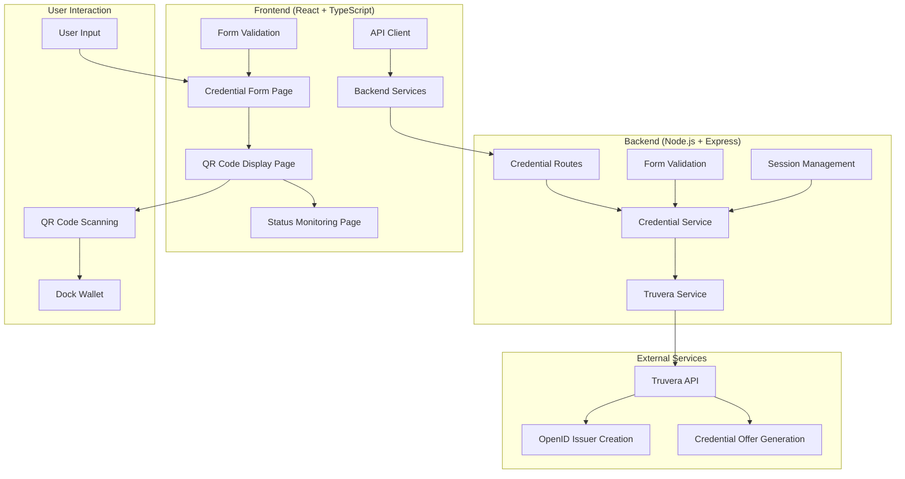
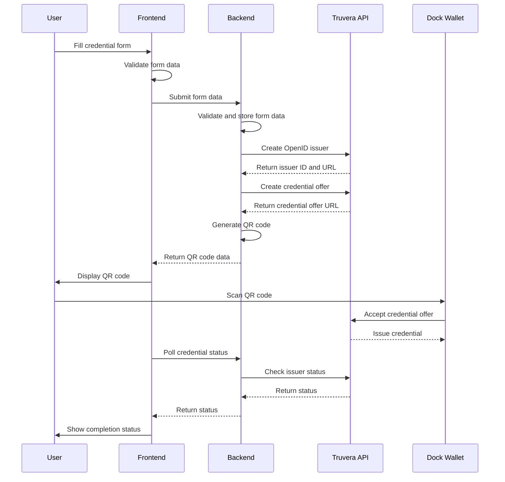

# Design Document

## Overview

This design document outlines the implementation of a comprehensive credential issuance system that integrates the functionality from the existing test script (`scripts/test-credential.js`) into the frontend and backend applications. The system will provide a web-based interface for inputting credential data, creating OpenID issuers, generating credential offers, displaying QR codes, and managing the complete credential issuance workflow.

The design focuses on:
1. **User Input Flow**: Replace random data generation with user-provided form data
2. **Backend Integration**: Implement the test script's Truvera API interactions in the backend services
3. **Frontend Interface**: Create a clean, intuitive web interface for credential issuance
4. **Code Cleanup**: Remove unused code and dependencies from both frontend and backend
5. **Error Handling**: Provide comprehensive error handling and user feedback
6. **Security**: Maintain secure API communication and data validation

## Architecture

### High-Level Architecture



### Data Flow



## Components and Interfaces

### Frontend Components

#### 1. Credential Form Component
**Purpose**: Collect user input for credential data
**Location**: `frontend/src/components/CredentialForm.tsx`

**Props Interface**:
```typescript
interface CredentialFormProps {
  onSubmit: (formData: CredentialFormData) => void;
  isLoading: boolean;
  errors?: Record<string, string>;
}
```

**Features**:
- Form fields for personal information (firstName, lastName, NIC, country, email)
- Investment information fields (investorType, kycLevel, amlStatus)
- Blockchain information (walletAddress)
- Real-time validation
- Error display
- Loading states

#### 2. QR Code Display Component
**Purpose**: Display generated QR codes with scanning instructions
**Location**: `frontend/src/components/QRCodeDisplay.tsx` (enhance existing)

**Props Interface**:
```typescript
interface QRCodeDisplayProps {
  qrCodeData: string;
  credentialOfferUrl: string;
  securityPIN: string;
  onRetry?: () => void;
  isLoading?: boolean;
}
```

**Features**:
- QR code visualization
- Fallback URL display
- Security PIN display
- Scanning instructions
- Troubleshooting tips
- Retry functionality

#### 3. Status Monitor Component
**Purpose**: Track and display credential issuance status
**Location**: `frontend/src/components/StatusMonitor.tsx`

**Props Interface**:
```typescript
interface StatusMonitorProps {
  sessionId: string;
  onComplete: (success: boolean) => void;
  pollInterval?: number;
}
```

**Features**:
- Real-time status polling
- Progress indicators
- Success/failure states
- Operation summaries
- Next steps guidance

#### 4. Operation Summary Component
**Purpose**: Display comprehensive operation summaries
**Location**: `frontend/src/components/OperationSummary.tsx`

**Props Interface**:
```typescript
interface OperationSummaryProps {
  sessionData: SessionData;
  operationResult: OperationResult;
  onStartNew: () => void;
}
```

### Backend Services

#### 1. Enhanced Credential Service
**Purpose**: Orchestrate credential issuance workflow
**Location**: `backend/src/services/credential.ts` (enhance existing)

**Key Methods**:
```typescript
class CredentialService {
  // Form data handling
  validateFormData(formData: CredentialFormData): ValidationResult;
  storeFormData(sessionId: string, formData: CredentialFormData): Promise<ServiceResponse>;
  
  // Credential issuance workflow
  createOpenIDIssuer(sessionId: string): Promise<IssuerCreationResponse>;
  generateCredentialOffer(sessionId: string): Promise<CredentialOfferResponse>;
  generateQRCode(sessionId: string): Promise<QRCodeResponse>;
  
  // Status monitoring
  getCredentialStatus(sessionId: string): Promise<StatusResponse>;
  getOperationSummary(sessionId: string): Promise<SummaryResponse>;
  
  // Cleanup and utilities
  cleanupExpiredSessions(): Promise<void>;
  getProcessStatistics(): Promise<StatisticsResponse>;
}
```

#### 2. Enhanced Truvera Service
**Purpose**: Handle all Truvera API interactions
**Location**: `backend/src/services/truvera.ts` (enhance existing)

**Key Methods**:
```typescript
class TruveraService {
  // OpenID issuer management
  createOpenIDIssuer(formData: CredentialFormData): Promise<OpenIDIssuerResponse>;
  createCredentialOffer(issuerId: string, formData: CredentialFormData): Promise<CredentialOfferResponse>;
  
  // Status monitoring
  getIssuerStatus(issuerId: string): Promise<IssuerStatusResponse>;
  getCredentialStatus(credentialId: string): Promise<CredentialStatusResponse>;
  
  // Utilities
  healthCheck(): Promise<boolean>;
  validateConfiguration(): Promise<ValidationResult>;
}
```

#### 3. QR Code Service
**Purpose**: Generate and manage QR codes
**Location**: `backend/src/services/qrcode.ts` (new)

**Key Methods**:
```typescript
class QRCodeService {
  generateQRCode(data: string, options?: QRCodeOptions): Promise<QRCodeResult>;
  generateQRCodeImage(data: string, filename?: string): Promise<string>;
  validateQRCodeData(data: string): boolean;
}
```

### API Endpoints

#### Enhanced Credential Routes
**Location**: `backend/src/routes/credentials.ts` (enhance existing)

**New/Enhanced Endpoints**:
```typescript
// Form data submission
POST /api/credentials/form
Body: { sessionId: string, formData: CredentialFormData }
Response: { success: boolean, message: string, nextStep: string }

// Create OpenID issuer and credential offer
POST /api/credentials/create-offer
Body: { sessionId: string }
Response: { success: boolean, issuerId: string, credentialOfferUrl: string, qrCodeData: string }

// Get comprehensive status
GET /api/credentials/status/:sessionId
Response: { success: boolean, status: string, summary: OperationSummary }

// Get operation summary
GET /api/credentials/summary/:sessionId
Response: { success: boolean, summary: ComprehensiveOperationSummary }
```

## Data Models

### Core Data Types

```typescript
// Enhanced credential form data
interface CredentialFormData {
  // Personal Information
  firstName: string;
  lastName: string;
  nic: string; // National Identity Card
  country: string;
  email?: string;
  
  // Investment Information
  investorType: 'Individual' | 'Company';
  kycLevel: 'basic' | 'advanced';
  amlStatus: boolean;
  
  // Blockchain Information
  walletAddress: string;
  
  // Generated Security Information
  securityPIN?: string; // 6-digit PIN for credential offers
}

// Operation result tracking
interface OperationResult {
  success: boolean;
  steps: OperationStep[];
  summary: OperationSummary;
  errors?: OperationError[];
}

interface OperationStep {
  name: string;
  status: 'pending' | 'in_progress' | 'completed' | 'failed';
  timestamp?: Date;
  details?: Record<string, any>;
}

// Comprehensive operation summary
interface OperationSummary {
  sessionId: string;
  formData: CredentialFormData;
  issuerId?: string;
  credentialOfferUrl?: string;
  qrCodeGenerated: boolean;
  credentialStatus: 'pending' | 'issued' | 'failed';
  startTime: Date;
  endTime?: Date;
  nextSteps: string[];
}
```

### Enhanced Session Data

```typescript
interface SessionData {
  sessionId: string;
  formData?: CredentialFormData;
  issuerId?: string;
  credentialOfferUrl?: string;
  qrCodeData?: string;
  securityPIN?: string;
  operationSteps: OperationStep[];
  createdAt: Date;
  updatedAt: Date;
  expiresAt: Date;
}
```

## Error Handling

### Frontend Error Handling

1. **Form Validation Errors**
   - Real-time field validation
   - Clear error messages
   - Field-specific error highlighting

2. **API Communication Errors**
   - Network error handling
   - Timeout management
   - Retry mechanisms

3. **User Experience Errors**
   - Loading state management
   - Graceful degradation
   - User-friendly error messages

### Backend Error Handling

1. **Truvera API Errors**
   - Authentication failures
   - Rate limiting
   - Service unavailability
   - Malformed responses

2. **Data Validation Errors**
   - Form data validation
   - Session data integrity
   - Configuration validation

3. **System Errors**
   - Database connectivity
   - Memory management
   - Process monitoring

### Error Response Format

```typescript
interface ErrorResponse {
  success: false;
  error: {
    code: string;
    message: string;
    details?: Record<string, any>;
    troubleshooting?: string[];
  };
  timestamp: string;
}
```


## Code Cleanup Strategy

### Frontend Cleanup

1. **Remove Unused Components**
   - Identify components not referenced in routes or other components
   - Remove unused utility functions
   - Clean up unused CSS classes

2. **Dependency Cleanup**
   - Remove unused npm packages
   - Update package.json
   - Clean up import statements

3. **Code Organization**
   - Consolidate similar functionality
   - Remove duplicate code
   - Improve file structure

### Backend Cleanup

1. **Remove Unused Services**
   - Identify unused service methods
   - Remove unused middleware
   - Clean up unused route handlers

2. **Dependency Cleanup**
   - Remove unused npm packages
   - Update package.json
   - Clean up require/import statements

3. **Code Organization**
   - Consolidate similar functionality
   - Remove duplicate code
   - Improve error handling consistency

### Cleanup Checklist

```typescript
// Areas to review for cleanup
interface CleanupAreas {
  frontend: {
    unusedComponents: string[];
    unusedHooks: string[];
    unusedUtilities: string[];
    unusedDependencies: string[];
  };
  backend: {
    unusedRoutes: string[];
    unusedServices: string[];
    unusedMiddleware: string[];
    unusedDependencies: string[];
  };
  shared: {
    unusedTypes: string[];
    duplicateCode: string[];
    outdatedConfigurations: string[];
  };
}
```

## Security Considerations

1. **Data Validation**
   - Server-side validation for all form inputs
   - Sanitization of user input
   - Type checking and format validation

2. **API Security**
   - Secure API key management
   - Request rate limiting
   - CORS configuration

3. **Session Security**
   - Secure session management
   - Session expiration handling
   - Data encryption for sensitive information

4. **Error Information**
   - Avoid exposing sensitive information in error messages
   - Log security events appropriately
   - Implement proper error boundaries

## Performance Considerations

1. **Frontend Performance**
   - Lazy loading of components
   - Efficient state management
   - Optimized re-rendering

2. **Backend Performance**
   - Connection pooling for API calls
   - Caching strategies
   - Efficient session storage

3. **API Performance**
   - Request batching where possible
   - Timeout management
   - Retry logic with exponential backoff

## Deployment Considerations

1. **Environment Configuration**
   - Separate configurations for development, staging, and production
   - Secure environment variable management
   - Configuration validation

2. **Build Process**
   - Optimized production builds
   - Asset optimization
   - Bundle size monitoring

3. **Monitoring**
   - Application performance monitoring
   - Error tracking
   - Usage analytics