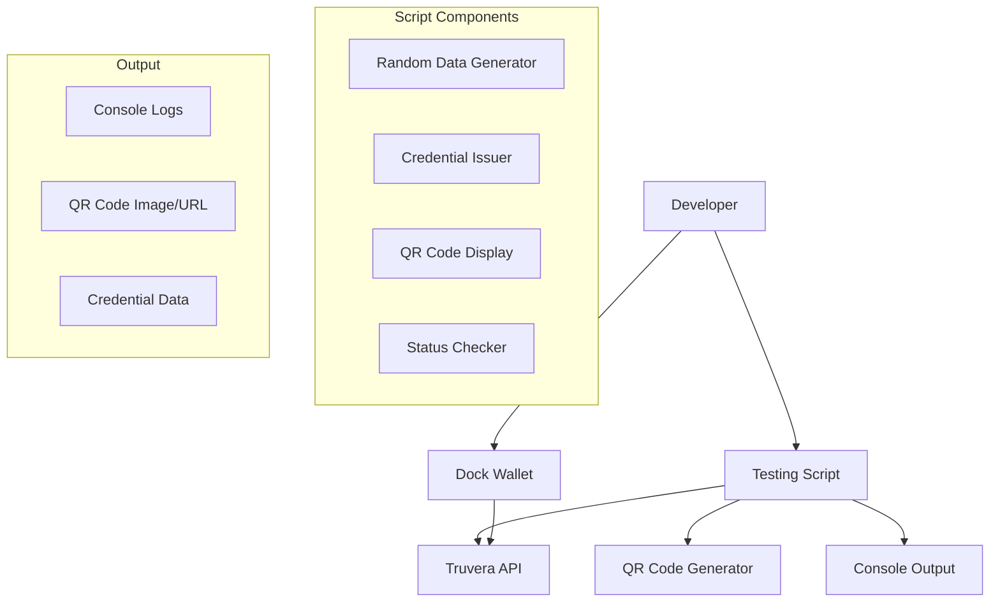

# Design Document

## Overview

The Credential Testing Flow is a simple standalone script designed to quickly test credential issuance and wallet integration with the Dock wallet. The system generates random test data, directly communicates with the Truvera API to issue credentials, creates DIDComm URLs, and displays QR codes for immediate testing.

This tool is completely independent of the existing frontend/backend system and focuses on direct API communication with Truvera. The design prioritizes simplicity and speed, providing a single script solution for developers to test the complete credential flow from generation to wallet reception.

## Architecture

### High-Level Architecture



### Technology Stack

**Script:**
- Node.js with TypeScript
- Direct HTTP requests to Truvera API (axios)
- QR Code generation library (qrcode)
- Console-based interface

**External Services:**
- Truvera API (direct integration)
- Dock wallet (user's mobile app)

## Components and Interfaces

### Script Components

#### 1. Main Testing Script
**Purpose:** Orchestrates the entire testing flow
**Functions:**
- `main()`: Entry point that runs the complete flow
- `generateTestData()`: Creates random test data
- `issueCredential()`: Issues credential with test data
- `displayResults()`: Shows QR code and credential details
- `waitForConfirmation()`: Waits for user to confirm wallet addition

#### 2. Data Generator Module
**Purpose:** Generates realistic random test data
**Functions:**
- `generatePersonalInfo()`: Creates names, email, country
- `generateNIC()`: Creates valid NIC format
- `generateWalletAddress()`: Creates valid Ethereum address
- `generateInvestorData()`: Creates investor type, KYC, AML data

#### 3. Truvera Client Module
**Purpose:** Direct communication with Truvera API
**Functions:**
- `createOpenIDIssuer()`: Creates issuer with test data
- `createDIDCommInvitation()`: Creates DIDComm connection
- `issueCredential()`: Issues the credential
- `checkStatus()`: Monitors credential status

#### 4. QR Code Generator Module
**Purpose:** Generates and displays QR codes
**Functions:**
- `generateQRCode()`: Creates QR code from URL
- `displayQRCode()`: Shows QR code in console/file
- `saveQRCode()`: Saves QR code as image file

### Data Models

#### TestCredentialData
```typescript
interface TestCredentialData {
  firstName: string;
  lastName: string;
  nic: string; // Generated NIC number
  country: string;
  email: string;
  walletAddress: string; // Generated Ethereum address
  investorType: 'Individual' | 'Company';
  kycLevel: 'basic' | 'advanced';
  amlStatus: boolean;
  // Testing metadata
  generatedAt: Date;
  testId: string;
}
```

#### TestingSession
```typescript
interface TestingSession {
  testId: string;
  currentStep: TestingStep;
  testData?: TestCredentialData;
  sessionId?: string; // Links to existing session system
  issuerId?: string;
  credentialId?: string;
  qrCodeData?: string;
  deliveryStatus: DeliveryStatus;
  createdAt: Date;
  expiresAt: Date;
}
```

#### TestingStep
```typescript
enum TestingStep {
  DATA_GENERATION = 'data_generation',
  CREDENTIAL_ISSUANCE = 'credential_issuance',
  QR_DISPLAY = 'qr_display',
  DELIVERY_VERIFICATION = 'delivery_verification',
  COMPLETED = 'completed'
}
```

#### DeliveryStatus
```typescript
enum DeliveryStatus {
  PENDING = 'pending',
  QR_GENERATED = 'qr_generated',
  SCANNED = 'scanned',
  DELIVERED = 'delivered',
  FAILED = 'failed'
}
```

## Data Generation Strategy

### Random Data Generation

#### Personal Information
- **Names:** Use realistic name databases with international coverage
- **Countries:** Select from valid ISO country codes with proper names
- **Email:** Generate realistic email addresses using name + domain combinations
- **NIC:** Generate valid format NIC numbers (country-specific patterns)

#### Blockchain Data
- **Wallet Addresses:** Generate valid Ethereum address format (0x + 40 hex characters)
- **Investor Types:** Randomly select between 'Individual' and 'Company'
- **KYC Levels:** Randomly select between 'basic' and 'advanced'
- **AML Status:** Randomly assign true/false with weighted probability

#### Data Templates
```typescript
interface DataTemplate {
  name: string;
  description: string;
  data: Partial<TestCredentialData>;
}

const templates: DataTemplate[] = [
  {
    name: 'Individual Investor - Basic KYC',
    description: 'Individual with basic KYC verification',
    data: {
      investorType: 'Individual',
      kycLevel: 'basic',
      amlStatus: true
    }
  },
  {
    name: 'Company Investor - Advanced KYC',
    description: 'Company with advanced KYC verification',
    data: {
      investorType: 'Company',
      kycLevel: 'advanced',
      amlStatus: true
    }
  }
];
```

### Data Validation

#### Format Validation
- Email format validation using regex
- Ethereum address format validation (0x + 40 hex)
- Country code validation against ISO standards
- NIC format validation (basic pattern matching)

#### Business Logic Validation
- Ensure all required fields are populated
- Validate investor type and KYC level combinations
- Check AML status consistency with KYC level

## Script Architecture

### Direct API Integration

#### Truvera API Client
Direct HTTP communication with Truvera API:
- No dependency on existing backend services
- Direct axios calls to Truvera endpoints
- Simple authentication with API key
- Minimal error handling and retry logic

#### Configuration Management
Simple environment-based configuration:
- Load API keys from environment variables
- Basic validation of required configuration
- No complex configuration management

### Script Structure

#### Main Script Flow
```typescript
async function main() {
  // 1. Generate random test data
  const testData = generateTestData();
  console.log('Generated test data:', testData);
  
  // 2. Issue credential via Truvera
  const credential = await issueCredential(testData);
  console.log('Credential issued:', credential.id);
  
  // 3. Create DIDComm invitation
  const invitation = await createDIDCommInvitation(credential.id);
  console.log('DIDComm URL:', invitation.url);
  
  // 4. Generate and display QR code
  const qrCode = await generateQRCode(invitation.url);
  console.log('QR Code generated - scan with Dock wallet');
  
  // 5. Wait for user confirmation
  await waitForUserConfirmation();
  console.log('Testing complete!');
}
```

#### Utility Functions
```typescript
function generateTestData(): TestCredentialData
function issueCredential(data: TestCredentialData): Promise<CredentialResult>
function createDIDCommInvitation(credentialId: string): Promise<InvitationResult>
function generateQRCode(url: string): Promise<string>
function waitForUserConfirmation(): Promise<void>
```

## Script Execution Flow

### Step-by-Step Flow

1. **Script Initialization**
   - Load environment variables and configuration
   - Validate Truvera API connectivity
   - Display script startup information

2. **Data Generation**
   - Generate random realistic test data
   - Display generated data in console
   - Log all generated values for reference

3. **Credential Issuance**
   - Create OpenID issuer with test data
   - Issue credential via Truvera API
   - Log credential ID and status

4. **DIDComm URL Creation**
   - Create DIDComm invitation for the credential
   - Generate QR code from the DIDComm URL
   - Display QR code in console (ASCII art) or save as image

5. **User Interaction**
   - Display instructions for Dock wallet
   - Wait for user to scan QR code and add to wallet
   - Prompt user to confirm successful addition
   - Exit script after confirmation

### Error Handling

#### API Communication Errors
- Simple retry mechanism for network failures
- Clear error messages from Truvera API
- Script exits gracefully on critical errors

#### Data Generation Errors
- Fallback values for failed random generation
- Basic validation of generated data
- Log warnings for any data issues

#### QR Code Generation Errors
- Fallback to displaying URL as text
- Option to save QR code as file if console display fails
- Clear instructions if QR code cannot be generated

## Testing Strategy

### Unit Testing
- **Data Generation:** Test random data generation and validation
- **API Integration:** Mock Truvera API responses for testing
- **Session Management:** Test session creation and cleanup
- **Error Handling:** Test all error scenarios and recovery

### Integration Testing
- **End-to-End Flow:** Test complete flow from generation to delivery
- **Truvera Integration:** Test with actual Truvera API (staging)
- **Session Integration:** Test integration with existing session system
- **Cleanup Testing:** Test automatic cleanup of expired sessions

### Manual Testing
- **Dock Wallet Testing:** Manual testing with actual Dock wallet
- **QR Code Scanning:** Test QR code generation and scanning
- **Cross-Device Testing:** Test on various devices and screen sizes
- **Error Recovery:** Test error scenarios and user recovery paths

### Performance Testing
- **Data Generation Speed:** Test generation performance under load
- **Concurrent Testing:** Test multiple simultaneous testing sessions
- **Memory Usage:** Monitor memory usage during extended testing
- **API Rate Limiting:** Test behavior under API rate limits

## Security Considerations

### Data Protection
- **Test Data Isolation:** Ensure test data doesn't interfere with production
- **Session Security:** Secure handling of testing sessions
- **API Key Protection:** Secure storage and usage of Truvera API keys
- **Data Cleanup:** Automatic cleanup of test data and sessions

### Access Control
- **Development Only:** Ensure testing interface is only available in development
- **Rate Limiting:** Implement rate limiting for testing endpoints
- **Input Validation:** Validate all test data inputs
- **Error Information:** Avoid exposing sensitive information in errors

### Credential Security
- **Test Credentials:** Ensure test credentials are clearly marked as test
- **Expiration:** Set short expiration times for test credentials
- **Cleanup:** Automatic cleanup of test credentials and issuers
- **Isolation:** Prevent test credentials from affecting production systems

## Script Setup and Configuration

### Environment Configuration
- **TRUVERA_API_URL:** Truvera API base URL
- **TRUVERA_API_KEY:** API key for authentication
- **ISSUER_DID:** DID of the credential issuer
- **CREDENTIAL_SCHEMA_URL:** URL of the DEIP credential schema

### Script Setup
- **Dependencies:** Minimal Node.js dependencies (axios, qrcode, dotenv)
- **Execution:** Simple `npm run test-credential` command
- **Output:** Console logs and optional QR code image file
- **No Database:** No persistent storage required

### Logging and Output
- **Console Logging:** All steps logged to console with timestamps
- **QR Code Display:** ASCII QR code in console or saved image file
- **Error Logging:** Clear error messages with troubleshooting hints
- **Success Confirmation:** Clear indication when testing is complete