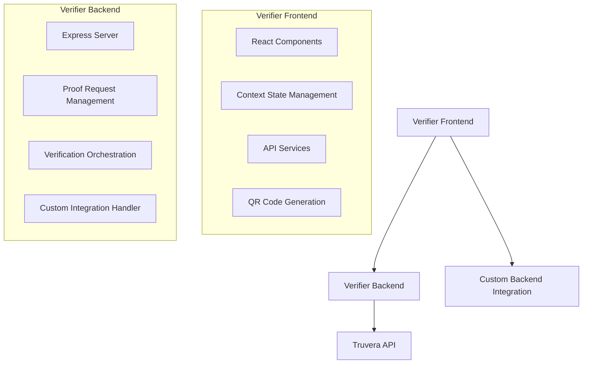

# Design Document

## Overview

The Credential Verifier UI is a React-based web application that provides a user-friendly interface for verifying digital credentials using the Truvera API. The application follows the same architectural patterns as the existing issuer frontend, utilizing React with TypeScript, Tailwind CSS for styling, and a context-based state management approach.

The verifier application will be built as a separate frontend application that can operate independently from the issuer system, allowing organizations to deploy verification capabilities without needing the full issuing infrastructure.

## Architecture

### High-Level Architecture



### Technology Stack

- **Frontend Framework**: React 18 with TypeScript
- **Styling**: Tailwind CSS
- **State Management**: React Context API
- **HTTP Client**: Axios
- **QR Code Generation**: qrcode library
- **Build Tool**: Vite
- **Backend**: Express.js with TypeScript
- **API Integration**: Truvera API for credential verification

### Directory Structure

```
verifier_frontend/
├── src/
│   ├── components/
│   │   ├── ProofRequestForm.tsx
│   │   ├── QRCodeDisplay.tsx
│   │   ├── StatusMonitor.tsx
│   │   ├── VerificationResults.tsx
│   │   ├── Layout.tsx
│   │   └── ErrorDisplay.tsx
│   ├── pages/
│   │   ├── ProofRequestPage.tsx
│   │   ├── QRCodePage.tsx
│   │   ├── VerificationPage.tsx
│   │   └── ResultsPage.tsx
│   ├── contexts/
│   │   └── VerifierContext.tsx
│   ├── services/
│   │   ├── api.ts
│   │   └── verification.ts
│   ├── types/
│   │   └── index.ts
│   ├── utils/
│   │   ├── validation.ts
│   │   └── formatting.ts
│   └── config/
│       └── api.ts

verifier_backend/
├── src/
│   ├── routes/
│   │   ├── proofRequests.ts
│   │   ├── verification.ts
│   │   └── integration.ts
│   ├── services/
│   │   ├── truveraService.ts
│   │   ├── verificationService.ts
│   │   └── integrationService.ts
│   ├── types/
│   │   └── index.ts
│   └── utils/
│       └── validation.ts
```

## Components and Interfaces

### Core Components

#### 1. ProofRequestForm Component
- **Purpose**: Create and configure proof requests
- **Props**: 
  - `onProofRequestCreated: (proofRequest: ProofRequest) => void`
  - `defaultCredentialTypes?: string[]`
- **State**: Form data for proof request configuration
- **Features**: 
  - Credential type selection
  - Required fields specification
  - Request name and purpose input
  - Validation and error handling

#### 2. QRCodeDisplay Component
- **Purpose**: Display QR codes for proof requests
- **Props**:
  - `proofRequest: ProofRequest`
  - `onPresentationReceived: (presentation: CredentialPresentation) => void`
- **State**: QR code generation status and display options
- **Features**:
  - QR code generation and display
  - Alternative URL display
  - Refresh/regenerate functionality
  - Instructions for users

#### 3. StatusMonitor Component
- **Purpose**: Monitor proof request status and presentation receipt
- **Props**:
  - `proofRequestId: string`
  - `onStatusUpdate: (status: ProofRequestStatus) => void`
  - `pollInterval?: number`
- **State**: Polling status and current proof request state
- **Features**:
  - Real-time status polling
  - Progress indicators
  - Timeout handling
  - Error state management

#### 4. VerificationResults Component
- **Purpose**: Display detailed verification results
- **Props**:
  - `verificationResult: VerificationResult`
  - `onCustomAction?: (result: VerificationResult) => void`
- **State**: Display preferences and custom action status
- **Features**:
  - Overall verification status display
  - Individual credential details
  - Issuer information
  - Validity period information
  - Custom action trigger

### Context and State Management

#### VerifierContext
```typescript
interface VerifierContextType {
  // Current verification session
  currentSession: VerificationSession | null;
  
  // Proof request management
  createProofRequest: (config: ProofRequestConfig) => Promise<ProofRequest>;
  monitorProofRequest: (proofRequestId: string) => void;
  
  // Verification process
  verifyPresentation: (presentation: CredentialPresentation) => Promise<VerificationResult>;
  
  // Custom integration
  triggerCustomAction: (result: VerificationResult) => Promise<void>;
  
  // Error handling
  error: ErrorState | null;
  clearError: () => void;
  
  // Loading states
  isLoading: boolean;
  loadingOperation: string | null;
}
```

## Data Models

### Core Types

```typescript
interface ProofRequestConfig {
  name: string;
  purpose: string;
  credentialTypes: string[];
  requiredFields: FieldRequirement[];
  timeoutMinutes?: number;
}

interface FieldRequirement {
  path: string;
  required: boolean;
  filter?: {
    type: string;
    const?: string;
    contains?: any;
  };
}

interface ProofRequest {
  id: string;
  qr: string;
  response_url: string;
  config: ProofRequestConfig;
  status: 'active' | 'completed' | 'expired' | 'failed';
  createdAt: string;
  expiresAt: string;
}

interface CredentialPresentation {
  holder: string;
  credentials: VerifiableCredential[];
  presentation_submission?: any;
}

interface VerifiableCredential {
  '@context': string[];
  type: string[];
  id: string;
  issuer: string | { id: string; name?: string };
  issuanceDate: string;
  expirationDate?: string;
  credentialSubject: Record<string, any>;
  proof?: any;
}

interface VerificationResult {
  verified: boolean;
  partiallyVerified: boolean;
  results: CredentialVerificationResult[];
  presentation: CredentialPresentation;
  timestamp: string;
}

interface CredentialVerificationResult {
  credential: VerifiableCredential;
  verified: boolean;
  error?: string;
  details?: {
    signatureValid: boolean;
    issuerTrusted: boolean;
    notExpired: boolean;
    schemaValid: boolean;
  };
}

interface VerificationSession {
  id: string;
  proofRequest: ProofRequest | null;
  presentation: CredentialPresentation | null;
  verificationResult: VerificationResult | null;
  status: 'creating' | 'waiting' | 'verifying' | 'completed' | 'failed';
  createdAt: string;
}
```

## Error Handling

### Error Categories

1. **Network Errors**: API connectivity issues, timeouts
2. **Validation Errors**: Invalid proof request configuration, malformed credentials
3. **Verification Errors**: Cryptographic verification failures, expired credentials
4. **Integration Errors**: Custom backend integration failures

### Error Handling Strategy

```typescript
interface ErrorState {
  type: 'network' | 'validation' | 'verification' | 'integration';
  code: string;
  message: string;
  details?: any;
  recoverable: boolean;
  retryAction?: () => void;
}
```

- **User-friendly messages**: Convert technical errors to understandable language
- **Retry mechanisms**: Provide retry options for recoverable errors
- **Fallback options**: Alternative workflows when primary methods fail
- **Error logging**: Comprehensive error tracking for debugging

## Testing Strategy

Testing will be handled separately and is not included in the initial implementation scope. The application will be built with testable architecture patterns to facilitate future testing implementation if needed.

## API Integration

### Truvera API Endpoints

1. **POST /proof-requests**: Create proof requests
2. **GET /proof-requests/{id}**: Get proof request status
3. **POST /verify**: Verify presentations

### Backend API Endpoints

1. **POST /api/proof-requests**: Create and manage proof requests
2. **GET /api/proof-requests/{id}/status**: Monitor proof request status
3. **POST /api/verify**: Orchestrate verification process
4. **POST /api/integration/custom-action**: Trigger custom backend actions

### Custom Integration Interface

```typescript
interface CustomIntegrationConfig {
  enabled: boolean;
  endpoint: string;
  method: 'POST' | 'PUT';
  headers?: Record<string, string>;
  transformPayload?: (result: VerificationResult) => any;
}

interface CustomActionPayload {
  verificationResult: VerificationResult;
  timestamp: string;
  sessionId: string;
  metadata?: Record<string, any>;
}
```

## Security Considerations

1. **API Key Management**: Secure storage and transmission of Truvera API keys
2. **CORS Configuration**: Proper cross-origin resource sharing setup
3. **Input Validation**: Comprehensive validation of all user inputs
4. **Error Information**: Avoid exposing sensitive information in error messages
5. **Session Management**: Secure handling of verification sessions
6. **Custom Integration Security**: Secure transmission of verification results to custom backends

## Performance Considerations

1. **Polling Optimization**: Efficient polling intervals to balance responsiveness and API rate limits
2. **Caching**: Cache proof request configurations and verification results where appropriate
3. **Lazy Loading**: Load components and resources on demand
4. **Bundle Optimization**: Code splitting and tree shaking for optimal bundle size
5. **Memory Management**: Proper cleanup of polling intervals and event listeners

## Deployment Architecture

### Frontend Deployment
- Static hosting (Netlify, Vercel, or AWS S3 + CloudFront)
- Environment-specific configuration
- CI/CD pipeline integration

### Backend Deployment
- Container-based deployment (Docker)
- Environment variable configuration
- Health check endpoints
- Logging and monitoring integration

### Environment Configuration
```typescript
interface EnvironmentConfig {
  VITE_API_URL: string;
  VITE_TRUVERA_API_URL: string;
  VITE_CUSTOM_INTEGRATION_ENABLED: boolean;
  VITE_DEFAULT_TIMEOUT_MINUTES: number;
}
```