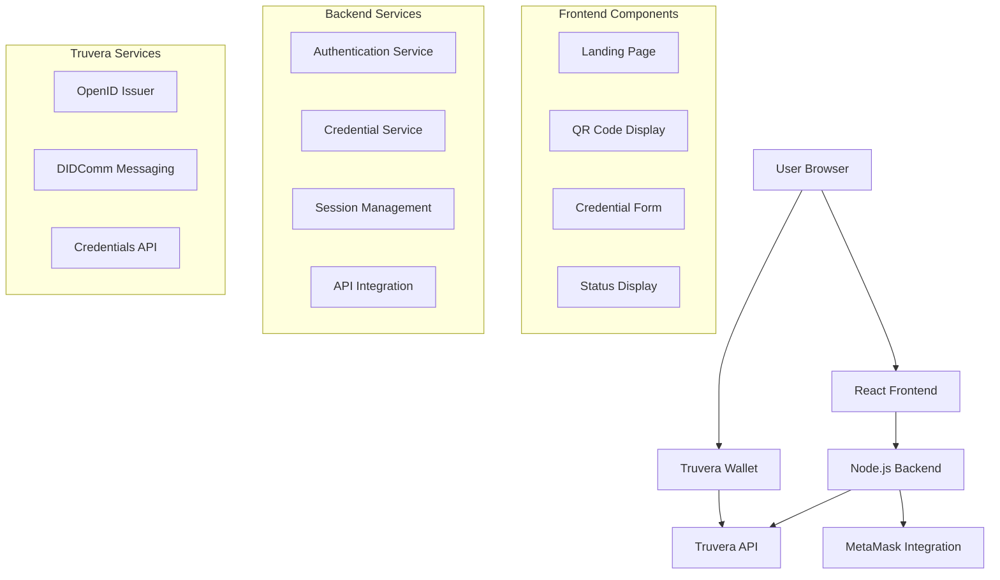

# Design Document

## Overview

The SSI Issuing Platform is a web-based application that enables users to connect their MetaMask wallet, establish a secure connection with their Truvera wallet, and receive verifiable credentials. The platform leverages the Truvera API for credential issuance using the OpenID for Verifiable Credential Issuance (OID4VCI) standard and DIDComm messaging for secure wallet communication.

The system follows a multi-step user journey: MetaMask wallet connection → form submission with integrated credential offer preparation → QR code scanning → credential delivery. The platform is designed to be responsive, secure, and user-friendly across all devices with enhanced form processing that immediately prepares credential offers upon successful form submission.

## Architecture

### High-Level Architecture



### Technology Stack

**Frontend:**
- React 18 with TypeScript
- Vite for build tooling
- Tailwind CSS for styling
- Web3.js for MetaMask integration
- QR Code generation library
- Axios for API communication

**Backend:**
- Node.js with Express.js
- TypeScript
- Express-session for session management
- Helmet for security headers
- CORS middleware
- Environment-based configuration

**External Services:**
- Truvera API (OpenID, Credentials, Messaging)
- MetaMask wallet integration
- Truvera wallet (user's mobile app)

## Components and Interfaces

### Frontend Components

#### 1. Landing Page Component
**Purpose:** Initial user entry point with MetaMask connection
**Props:** None
**State:**
- `walletConnected: boolean`
- `walletAddress: string | null`
- `connectionError: string | null`
- `isConnecting: boolean`

**Methods:**
- `connectMetaMask()`: Initiates MetaMask connection
- `handleConnectionError()`: Manages connection error states

#### 2. QR Code Component
**Purpose:** Displays QR code for Truvera wallet connection
**Props:**
- `qrCodeUrl: string`
- `onConnectionEstablished: () => void`

**State:**
- `qrCodeData: string`
- `connectionStatus: 'pending' | 'connected' | 'expired'`
- `retryCount: number`

**Methods:**
- `generateQRCode()`: Creates QR code for wallet connection
- `pollConnectionStatus()`: Checks connection status periodically
- `regenerateQRCode()`: Creates new QR code on expiration

#### 3. Credential Form Component
**Purpose:** Collects user information and initiates credential offer preparation
**Props:**
- `walletAddress: string`
- `onSubmit: (formData: CredentialFormData) => void`

**State:**
- `formData: CredentialFormData`
- `validationErrors: ValidationErrors`
- `isSubmitting: boolean`
- `submitAttempts: number`
- `showSuccess: boolean`

**Methods:**
- `validateForm()`: Enhanced validation with sanitization using `processFormData()`
- `handleSubmit()`: Comprehensive form processing including credential offer preparation
- `resetForm()`: Clears form data
- `isFormReadyForSubmission()`: Checks form readiness before submission

**Enhanced Features:**
- **Integrated Credential Offer Preparation**: Automatically prepares credential offer upon successful form submission
- **Enhanced Success Confirmation**: Shows detailed completion steps and next actions
- **Comprehensive Error Handling**: Specific error messages with retry logic
- **Progress Tracking**: Real-time status updates during form processing

#### 4. Status Display Component
**Purpose:** Shows progress and status updates throughout the process
**Props:**
- `currentStep: ProcessStep`
- `status: 'loading' | 'success' | 'error'`
- `message: string`

### Backend API Endpoints

#### 1. Session Management
```typescript
POST /api/session/create
- Creates new user session
- Returns session ID and initial state

GET /api/session/:sessionId
- Retrieves session state
- Returns current process step and data

PUT /api/session/:sessionId
- Updates session state
- Accepts step updates and user data
```

#### 2. Wallet Connection
```typescript
POST /api/wallet/connect
- Validates MetaMask connection
- Stores wallet address in session
- Returns connection confirmation

POST /api/wallet/qr-generate
- Creates QR code for Truvera wallet connection
- Generates DIDComm connection invitation
- Returns QR code data and connection ID

GET /api/wallet/connection-status/:connectionId
- Polls Truvera wallet connection status
- Returns connection state and holder DID
```

#### 3. Credential Issuance
```typescript
POST /api/credentials/form
- Stores form data in session
- Validates and sanitizes form inputs
- Returns success confirmation and next step

POST /api/credentials/qr-generate
- Creates OpenID issuer for credential issuance
- Generates credential offer with form data
- Creates QR code for wallet scanning
- Returns QR code data and connection details

POST /api/credentials/issue
- Issues credential using stored form data
- Creates credential offer
- Sends credential to holder's wallet via DIDComm
- Returns issuance status and credential ID

GET /api/credentials/status/:sessionId
- Checks credential delivery status
- Returns delivery confirmation and status

POST /api/credentials/validate
- Validates form data in real-time
- Returns validation results and errors
```

### Data Models

#### CredentialFormData
```typescript
interface CredentialFormData {
  firstName: string;
  lastName: string;
  country: string;
  email: string;
  walletAddress: string;
  investorType: 'Individual' | 'Company';
  kycLevel: 'basic' | 'advanced';
  amlStatus: boolean;
}
```

#### SessionState
```typescript
interface SessionState {
  sessionId: string;
  currentStep: ProcessStep;
  walletAddress?: string;
  holderDID?: string;
  connectionId?: string;
  issuerId?: string;
  credentialId?: string;
  createdAt: Date;
  expiresAt: Date;
}
```

#### ProcessStep
```typescript
enum ProcessStep {
  WALLET_CONNECTION = 'wallet_connection',
  QR_GENERATION = 'qr_generation',
  WALLET_PAIRING = 'wallet_pairing',
  FORM_SUBMISSION = 'form_submission',
  CREDENTIAL_ISSUANCE = 'credential_issuance',
  COMPLETION = 'completion'
}
```

## Data Models

### Truvera Integration Models

#### OpenID Issuer Configuration
```typescript
interface OpenIDIssuerConfig {
  credentialOptions: {
    credential: {
      type: string[];
      context: string[];
      subject: Partial<CredentialSubject>;
      expirationDate?: string;
      issuer: string;
    };
  };
  singleUse: boolean;
}
```

#### Credential Subject (DEIP Access Credential)
```typescript
interface CredentialSubject {
  id: string; // Holder DID
  firstName: string;
  lastName: string;
  country: string;
  email: string;
  walletAddress: string;
  investorType: string;
  kycLevel: string;
  amlStatus: boolean;
}
```

#### DIDComm Message Structure
```typescript
interface DIDCommMessage {
  type: string;
  to: string; // Holder DID
  message: {
    type: string;
    payload: any;
  };
}
```

## Enhanced Form Processing Workflow

### Form Submission Flow
The enhanced form processing system provides a streamlined user experience by integrating credential offer preparation directly into the form submission process:

1. **Form Validation Phase**
   - Enhanced client-side validation with `processFormData()`
   - Form readiness checks with `isFormReadyForSubmission()`
   - Real-time error display and field-level validation

2. **Form Submission Phase**
   - Sanitized data submission to `/api/credentials/form`
   - Session storage of validated form data
   - Automatic retry logic with exponential backoff

3. **Credential Offer Preparation Phase**
   - Immediate credential offer generation via `/api/credentials/qr-generate`
   - OpenID issuer creation with form data
   - QR code generation for wallet scanning

4. **Success Confirmation Phase**
   - Enhanced success UI with completed steps checklist
   - Clear next steps guidance for QR code scanning
   - Automatic navigation to QR code page

### Form Processing Utilities

#### `processFormSubmission()`
Comprehensive workflow handler that manages the entire form submission process:
```typescript
const result = await processFormSubmission(
  formData,
  sessionId,
  (progress) => updateUI(progress)
);
```

#### Progress Tracking
- Real-time progress updates with callbacks
- User-friendly status messages
- Progress percentages (0-100%)
- Error handling with specific error codes

#### Enhanced Error Handling
- Specific error codes: `INVALID_FORM_DATA`, `SESSION_EXPIRED`, `WALLET_NOT_CONNECTED`
- User-friendly error messages with actionable guidance
- Automatic retry mechanisms for transient failures
- Graceful degradation on service unavailability

## Error Handling

### Frontend Error Handling
- **MetaMask Connection Errors:** Display user-friendly messages for common issues (not installed, locked, network errors)
- **QR Code Errors:** Automatic retry mechanism with exponential backoff
- **Form Validation Errors:** Real-time validation with specific field-level error messages
- **Network Errors:** Retry mechanisms with user notification

### Backend Error Handling
- **Truvera API Errors:** Proper error mapping and logging with fallback mechanisms
- **Session Errors:** Automatic session cleanup and recovery
- **Validation Errors:** Comprehensive input validation with detailed error responses
- **Rate Limiting:** Implement rate limiting to prevent abuse

### Error Response Format
```typescript
interface ErrorResponse {
  success: false;
  error: {
    code: string;
    message: string;
    details?: any;
  };
  timestamp: string;
}
```

## Testing Strategy

### Unit Testing
- **Frontend Components:** Jest and React Testing Library for component testing
- **Backend Services:** Jest for service layer testing
- **API Integration:** Mock Truvera API responses for isolated testing
- **Utility Functions:** Comprehensive testing of validation and helper functions

### Integration Testing
- **API Endpoints:** Supertest for endpoint testing
- **Wallet Integration:** Mock MetaMask provider for integration tests
- **Session Management:** Test session lifecycle and state management
- **Error Scenarios:** Test error handling and recovery mechanisms

### End-to-End Testing
- **User Journey:** Playwright for complete user flow testing
- **Cross-Browser Testing:** Test on Chrome, Firefox, Safari, and Edge
- **Mobile Testing:** Test responsive design and mobile interactions
- **QR Code Scanning:** Test QR code generation and scanning workflow

### Security Testing
- **Input Validation:** Test for XSS, SQL injection, and other common vulnerabilities
- **Session Security:** Test session management and CSRF protection
- **API Security:** Test authentication and authorization mechanisms
- **Data Privacy:** Ensure sensitive data is properly handled and not logged

### Performance Testing
- **Load Testing:** Test API endpoints under various load conditions
- **Frontend Performance:** Test component rendering and state management performance
- **QR Code Generation:** Test QR code generation speed and reliability
- **Mobile Performance:** Test performance on various mobile devices

### Test Environment Setup
- **Mock Services:** Create mock implementations of Truvera API for testing
- **Test Data:** Prepare test datasets for various scenarios
- **CI/CD Integration:** Automated testing in continuous integration pipeline
- **Test Reporting:** Comprehensive test coverage and reporting

## Security Considerations

### Data Protection
- **Sensitive Data Handling:** Never log sensitive user information
- **Encryption in Transit:** All API communications use HTTPS
- **Session Security:** Secure session management with proper expiration
- **Input Sanitization:** Comprehensive input validation and sanitization

### API Security
- **Authentication:** Secure storage and handling of Truvera API keys
- **Rate Limiting:** Implement rate limiting to prevent abuse
- **CORS Configuration:** Proper CORS setup for frontend-backend communication
- **Security Headers:** Implement security headers (CSP, HSTS, etc.)

### Wallet Security
- **MetaMask Integration:** Follow MetaMask security best practices
- **DID Management:** Secure handling of DIDs and cryptographic operations
- **Connection Security:** Secure DIDComm message handling
- **Private Key Protection:** Never handle or store private keys

## Deployment Architecture

### Environment Configuration
- **Development:** Local development with mock services
- **Staging:** Full integration testing environment
- **Production:** Secure production deployment with monitoring

### Infrastructure Requirements
- **Frontend Hosting:** Static site hosting (Vercel, Netlify, or AWS S3)
- **Backend Hosting:** Node.js hosting (AWS EC2, Heroku, or similar)
- **SSL Certificates:** HTTPS for all environments
- **Environment Variables:** Secure configuration management

### Monitoring and Logging
- **Application Monitoring:** Track application performance and errors
- **API Monitoring:** Monitor Truvera API integration health
- **User Analytics:** Track user journey completion rates
- **Security Monitoring:** Monitor for security threats and anomalies