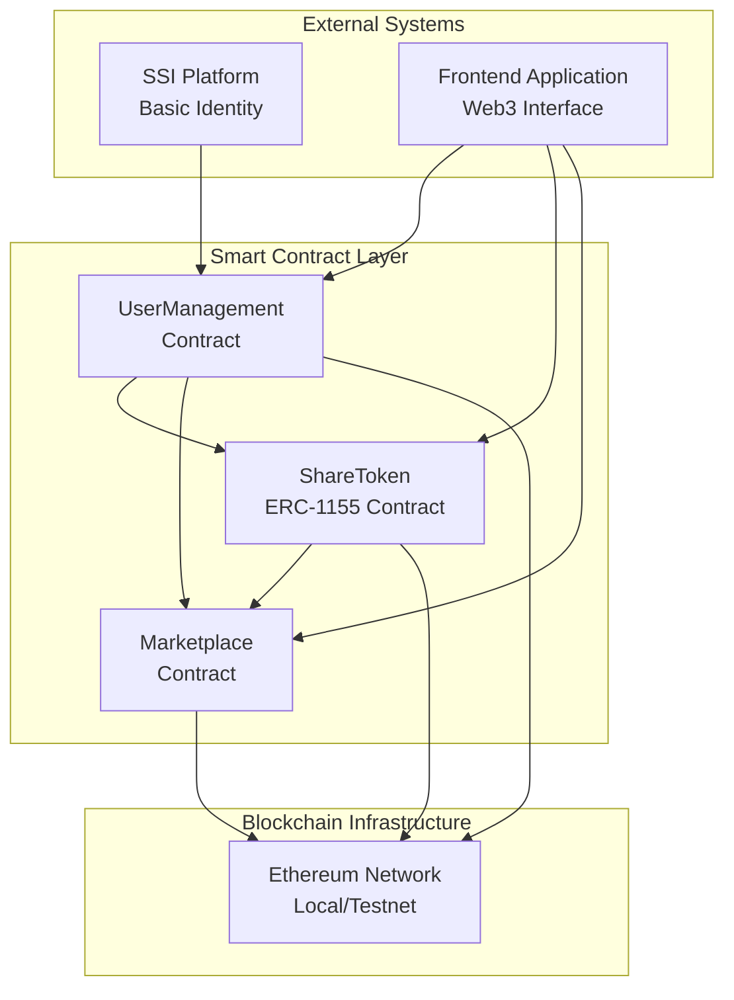
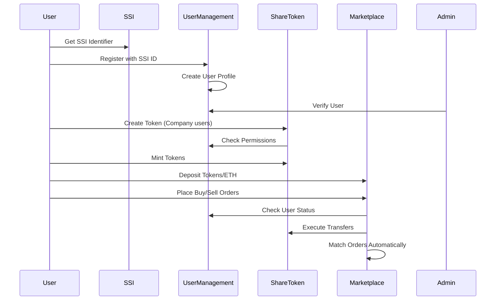

# Design Document

## Overview

The Blockchain Share Market system is a smart contract platform designed for a university final year project that demonstrates key blockchain concepts including Self-Sovereign Identity (SSI) integration, ERC-1155 token creation, and order book trading. The system implements a clean three-contract architecture that separates user management, token operations, and marketplace trading while maintaining simplicity appropriate for academic purposes.

The platform integrates with SSI systems for user authentication and implements a basic verification system. The design focuses on demonstrating core blockchain trading concepts with automatic order matching while keeping the implementation manageable for a university project scope.

## Architecture

### High-Level Architecture



### Contract Interaction Flow



## Components and Interfaces

### 1. UserManagement Contract

**Purpose:** Simple user registration, verification, and permission management with SSI integration.

**Key Components:**
- **User Registration System:** Handles SSI integration and basic user profile creation
- **Simple Verification:** Admin-based user verification system
- **Permission Manager:** Controls trading and token creation permissions
- **Basic Security:** User suspension and basic access controls

**Core Interfaces:**
```solidity
interface IUserManagement {
    function registerUser(string memory ssiIdentifier, UserType userType) external;
    function verifyUser(address user) external; // Admin only
    function suspendUser(address user) external; // Admin only
    function canUserTrade(address user) external view returns (bool);
    function canUserCreateTokens(address user) external view returns (bool);
    function isUserVerified(address user) external view returns (bool);
}
```

**State Management:**
- User profiles with SSI identifiers and verification status
- Simple permission flags (canTrade, canCreateTokens)
- Admin controls for verification and suspension
- Basic user activity tracking

### 2. ShareToken Contract (ERC-1155)

**Purpose:** Simple multi-token implementation for company share certificates with basic metadata.

**Key Components:**
- **Token Factory:** Creates new token types with essential metadata
- **Supply Manager:** Controls token minting with max supply limits
- **Transfer Controller:** Basic permission checks for transfers
- **Metadata Manager:** Stores basic token information
- **Integration Layer:** Simple integration with UserManagement contract

**Core Interfaces:**
```solidity
interface IShareToken {
    function createToken(
        string memory name,
        string memory symbol,
        string memory companyName,
        uint256 maxSupply,
        uint256 initialPrice
    ) external returns (uint256);
    
    function mintToken(address to, uint256 tokenId, uint256 amount) external;
    function marketplaceTransfer(address from, address to, uint256 id, uint256 amount) external;
    function getTokenInfo(uint256 tokenId) external view returns (TokenInfo memory);
    function getAllTokens() external view returns (uint256[] memory);
}
```

**Token Metadata Structure:**
- Basic information (name, symbol, company name)
- Creator address and creation timestamp
- Supply management (current supply, max supply)
- Initial price setting
- Active status flag

### 3. Marketplace Contract

**Purpose:** Simple trading platform with basic order book and automatic order matching.

**Key Components:**
- **Order Book Engine:** Maintains buy/sell order books per token
- **Simple Matching Engine:** Basic automatic order matching by price
- **Escrow System:** Holds funds and tokens during trading
- **Balance Manager:** Simple deposit/withdrawal system
- **Basic Fee System:** Simple percentage-based trading fees
- **Trade History:** Basic trade recording

**Core Interfaces:**
```solidity
interface IMarketplace {
    function depositETH() external payable;
    function withdrawETH(uint256 amount) external;
    function depositTokens(uint256 tokenId, uint256 amount) external;
    function withdrawTokens(uint256 tokenId, uint256 amount) external;
    function placeBuyOrder(uint256 tokenId, uint256 amount, uint256 price) external returns (uint256);
    function placeSellOrder(uint256 tokenId, uint256 amount, uint256 price) external returns (uint256);
    function cancelOrder(uint256 orderId) external;
    function getOrderBook(uint256 tokenId) external view returns (Order[] memory buyOrders, Order[] memory sellOrders);
    function getUserBalance(address user) external view returns (uint256 ethBalance, uint256[] memory tokenIds, uint256[] memory tokenBalances);
}
```

**Order Management:**
- Simple order structure with essential fields
- Basic status tracking (active, filled, cancelled)
- Simple price-based matching
- No expiration (orders stay active until filled/cancelled)

## User Types

The platform supports two user types with a simple distinction:

### Individual Users
- Personal traders who can trade tokens but cannot create new tokens
- Standard verification through SSI identity system
- All trading functions available

### Company Users  
- Business entities that can both trade tokens AND create/mint new tokens
- Enhanced verification including business registration documents
- Full platform access including token creation capabilities

**Key Difference:** Only Company users can create and mint tokens. Individual users can only trade existing tokens.

## Data Models

### User Profile Model
```solidity
struct UserProfile {
    address userAddress;        // Ethereum address
    string ssiIdentifier;      // SSI system identifier
    UserType userType;         // Individual or Company
    bool isVerified;           // Simple verification status
    bool canTrade;             // Trading permission flag
    bool canCreateTokens;      // Token creation permission flag
    bool isSuspended;          // Suspension status
    uint256 registrationDate;  // Registration timestamp
}
```

### Token Info Model
```solidity
struct TokenInfo {
    string name;               // Token name
    string symbol;             // Token symbol
    string companyName;        // Issuing company name
    uint256 currentSupply;     // Current minted supply
    uint256 maxSupply;         // Maximum supply limit
    uint256 initialPrice;      // Initial price in wei
    address creator;           // Token creator address
    uint256 createdAt;         // Creation timestamp
    bool isActive;             // Active status flag
}
```

### Order Model
```solidity
struct Order {
    uint256 orderId;           // Unique order identifier
    address trader;            // Order creator address
    uint256 tokenId;           // Token being traded
    uint256 amount;            // Order amount
    uint256 price;             // Price per token in wei
    uint256 filledAmount;      // Amount already filled
    OrderType orderType;       // BUY or SELL
    OrderStatus status;        // Order status (Active, Filled, Cancelled)
    uint256 createdAt;         // Creation timestamp
}
```

### Trade Model
```solidity
struct Trade {
    uint256 tradeId;           // Unique trade identifier
    address buyer;             // Buyer address
    address seller;            // Seller address
    uint256 tokenId;           // Token traded
    uint256 amount;            // Amount traded
    uint256 price;             // Execution price
    uint256 executedAt;        // Execution timestamp
    uint256 totalFee;          // Total fee collected
}
```

## Error Handling

### Validation Strategy
- **Input Validation:** Basic parameter checking at function entry
- **State Validation:** Verify user verification status and permissions
- **Permission Validation:** Check user permissions for trading and token creation
- **Balance Validation:** Ensure sufficient balances for operations

### Error Categories
1. **Authentication Errors:** Unregistered users, unverified accounts
2. **Authorization Errors:** Insufficient permissions, suspended accounts
3. **Validation Errors:** Invalid parameters, zero amounts
4. **State Errors:** Insufficient balances, inactive tokens
5. **Business Logic Errors:** Self-trading prevention, duplicate registrations

### Error Handling Patterns
```solidity
// Clear error messages
require(condition, "Clear error description");

// Simple permission checks
modifier onlyVerifiedUser() {
    require(userManagement.canUserTrade(msg.sender), "User not verified for trading");
    _;
}

modifier onlyCompanyUser() {
    require(userManagement.canUserCreateTokens(msg.sender), "Only companies can create tokens");
    _;
}

// Basic validation
modifier validAmount(uint256 amount) {
    require(amount > 0, "Amount must be greater than zero");
    _;
}
```

## Testing Strategy

### Basic Testing Approach
- **Contract Testing:** Test each contract's main functions
- **Function Testing:** Test core functionality of public functions
- **Basic Error Testing:** Test main error conditions
- **Integration Testing:** Test contract interactions

### Test Categories
1. **User Registration and Verification Tests**
   - Test SSI registration process
   - Test admin verification functionality
   - Test user permission checks

2. **Token Creation Tests**
   - Test company users can create tokens
   - Test individual users cannot create tokens
   - Test token metadata storage

3. **Basic Trading Tests**
   - Test order placement (buy/sell)
   - Test simple order matching
   - Test balance updates after trades

4. **Balance Management Tests**
   - Test ETH deposits and withdrawals
   - Test token deposits and withdrawals
   - Test balance queries

5. **Basic Security Tests**
   - Test user suspension functionality
   - Test permission enforcement
   - Test basic access controls

### Testing Tools
- **Hardhat:** Testing framework
- **Chai:** Assertion library
- **Ethers.js:** Blockchain interaction
- **JavaScript/TypeScript:** Test development

### Test Approach
- Focus on core functionality working correctly
- Test main user workflows end-to-end
- Verify basic security measures
- Ensure contracts interact properly
- Simple test data and scenarios

## Security Considerations

### Basic Access Control
- **Admin Controls:** Simple admin role for user verification and system management
- **User Permissions:** Basic permission checks for trading and token creation
- **User Suspension:** Admin ability to suspend problematic users
- **Contract Pausing:** Basic pause functionality for emergency situations

### Basic Attack Prevention
- **Reentrancy Protection:** Use ReentrancyGuard on state-changing functions
- **Integer Overflow Protection:** Use Solidity 0.8+ built-in overflow protection
- **Input Validation:** Basic parameter validation on all functions
- **Self-Trading Prevention:** Prevent users from trading with themselves

### Data Management
- **Minimal On-Chain Data:** Store only essential trading and user data
- **SSI Integration:** Use external SSI for identity, store only identifiers
- **Basic Privacy:** Don't store unnecessary personal information on-chain
- **Simple Audit Trail:** Basic event logging for important operations

### Development Security
- **Code Simplicity:** Keep contracts simple and readable
- **Standard Patterns:** Use well-known Solidity patterns
- **Basic Testing:** Ensure core functionality is tested
- **Clear Documentation:** Document all functions and their purposes