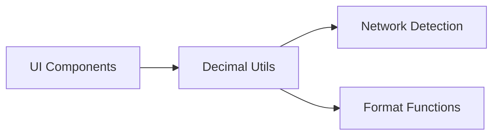

# Design Document

## Overview

A simple decimal handling utility that detects the network and uses the correct decimal places (8 for Hedera, 18 for Ethereum). No complex architecture - just utility functions that replace parseEther/formatEther calls.

## Architecture

Simple utility file with two main functions:
- `parseAmount(input: string)` - converts user input to blockchain format
- `formatAmount(amount: bigint)` - converts blockchain amounts to display format



## Components and Interfaces

### Decimal Utility Functions

```typescript
// Simple network detection
function getNetworkDecimals(): number {
  // Check if we're on Hedera (chainId 296 or 297)
  const chainId = window.ethereum?.chainId
  return chainId === '0x128' || chainId === '0x129' ? 8 : 18
}

// Replace parseEther
function parseAmount(input: string): bigint {
  const decimals = getNetworkDecimals()
  return parseUnits(input, decimals)
}

// Replace formatEther  
function formatAmount(amount: bigint): string {
  const decimals = getNetworkDecimals()
  return formatUnits(amount, decimals)
}
```

## Data Models

Just need to track which network we're on:

```typescript
const NETWORK_DECIMALS = {
  ETHEREUM: 18,
  HEDERA: 8
}
```

## Error Handling

Keep it simple:
- Try-catch around conversions
- Return original value if formatting fails
- Show "Invalid amount" for bad inputs

```typescript
function safeFormatAmount(amount: bigint): string {
  try {
    return formatAmount(amount)
  } catch (error) {
    return amount.toString() // fallback to raw value
  }
}
```

## Testing Strategy

Basic tests for:
- Parsing user input correctly for both networks
- Formatting amounts correctly for both networks  
- Error handling for invalid inputs
- Network detection works